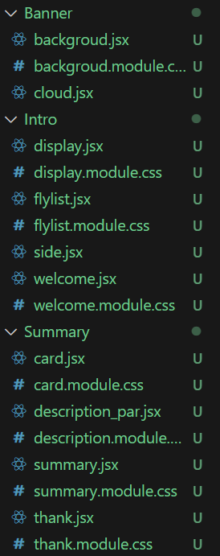

# 732-Tech_Demo_test Topic: Scrolling / parallax animation libraries

# React Scroll Parallax:  
## Usage:
<h3>
1.insatll repository by npm: 

`npm install react-scroll-parallax`  
2.Remember 
`import { ParallaxProvider } from 'react-scroll-parallax'`  
-when we need to use {useParallax or Parallax}, we need to make sure ParallaxProvider is outside  
</h3>

---

## Create effects: 
<h3>Parallax Props -> useParallax() Parallax ParallaxBanner --> make our web looks has layer


1.*(Basic)* Parallax: the main component for applying scroll effects**   
-->control speed,translate    

2.ParallaxBanner:
Component that sets up layer of useParallax elements to achieve parallaxing banner, images or custom markup with scroll effects in a container that hides overflow.</h3>  

---
## How it works:
<h3>
as the element scroll past the viewport a css translate effect is applied based on the original element's
position relative to the viewport. Using the different speed which it will have comparation,
so it looks like different elements have different layers.
</h3>

---
  

## Scroll Effects
<h3>1.Around z/y-axis(z-axis is default):</h3> 

`const parallax = useParallax({rotate:[0,360]/rotateY:[0,360]})`  

<h3> use rotate props to rotate an element around z/y </h3>  

<h3>2.Scale: </h3>  
<h3> scale an element up or down along any axis  </h3>  

`const mage = useParallax({scale: [x, y, 'easeInQuad']}`  
<h3>x represents the starting value of scaling and y represents the ending value of scaling.  
for example, x=1.5 y=1 means when we scroll the elements will reduce to original size.</h3>

---


## Parallax Banners, Advanced Banners 
<h3> 
for example: 2 layers, we set it background and one foreground. The order of the defined layer 
determines the stacking of each image, first in the array will appear at the back and be 
coverd by subsequent layers.   
The image prop defines the layer image. The speed prop is used to make the layer move at it's own pace  
The foreground speed is defined so that it will move faster than the background.
</h3>

---

## Easing Animation 
<h3>
We found at the part of scale, we use "easeInQuad" there. It represents the slow motion function used, which
 is the rate of change function of the animation effect.  
 </h3> 

 ```
 const parallax = useParallax({  
    easing: 'easeOutQuad',  
    translateX: [0, 100], });
```
translateX represent starting from the current position of the element, move it horizontally
by 100 units, adn then at the end of the animation, the element stays in its new position.

---
    
# Parallax(my file):  
   
## Banner: 2 Componets
<h3>
Componets1(background) is contain 2 layers(bg.jpg and man.jpg) 
   
Componets2(cloud)
</h3>

---

## Intro:  4 Componets  
<h3>
Componet1: welcome, when we scoll down, letter spacing will increase  

Componet2: side, make z-index minimum which make sure it at the bottom layer  
Componet3: display, "parallax" will rotate along y-axis  
Componet4: flylist, has 2 layer, backgroud and function I use, can click it into the detail webpage to know
how to complete that.
</h3>    

---
## Summary:  4 Componets
<h3>
Componet1: Card, import 9 images, when you scoll to the end, it will be a full picture    

Componet2: Decription, some information about parallax, you can find it by click the link  
Componet3: Summary, the title of the last part (use the same function as welcome and display)
Componet4: Thanks, the end of my work

</h3>

---


# Atropos：  

## useage
<h3>
1.install repository by npm:

`npm i atropos`  
`import Atropos from 'atropos/react'`  
</h3>

---
## How to work

<h3>
The Atropos can make you element change by the cursor.
The most important thing in this is to learn how to use the function.
</h3>

```
<Atropos
        alwaysActive --whether to always activate the Atropos.js plugin
        commonOrigin={true} -- whether to use the same starting position for all images
        rotateTouch="scroll-y" --the way to rotate touch
        rotateXInvert -- whether to invert the rotation direction on the X-axis,defaults to false
        rotateYInvert -- whether to invert the rotation direction on the Y-axis, defaults to false.
        stretchX={20} --the percentage to stretch the image on the X-axis
        stretchY={30} --the percentage to stretch the image on the Y-axis
        rotateXMax={10} -- the maximum rotation angle on the X-axis
        rotateYMax={10} -- the maximum rotation angle on the Y-axis
        duration={400} -- the duration of the animation in milliseconds
        eventsEl=".atropos-multiple" --the element to bind touch events to
>
...
</Atropos>
```
<h3>
The key to achieving the method which I show in my page is</h3><h2>eventsEl=".atropos-multiple"</h2>
<h3>You need to give the comtain a css of the name of eventsEl which make those elements become a whole thing  

They will follow your cursor to change.
</h3>

`<div className={styles.myAtropos + ' atropos-multiple'}>`


   
